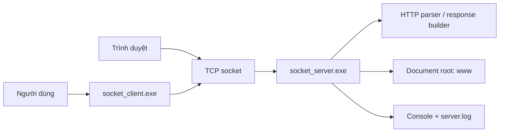
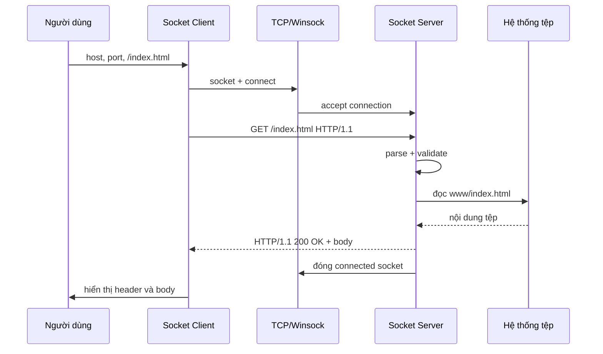
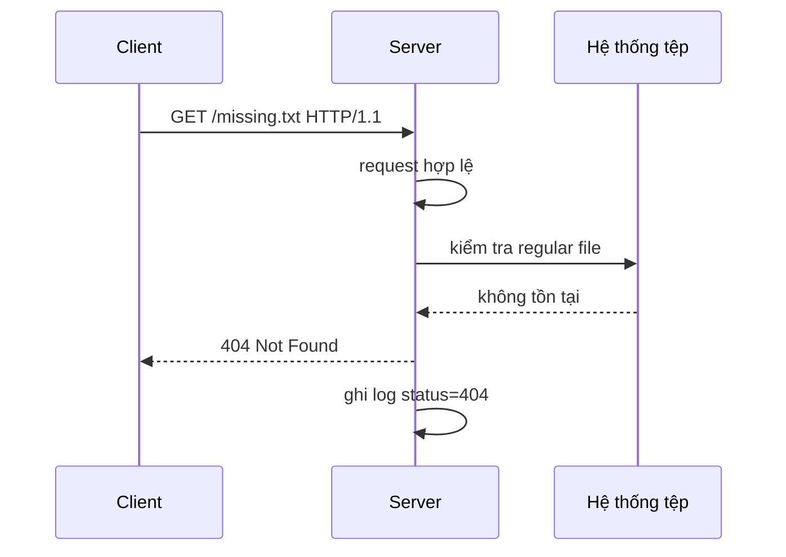
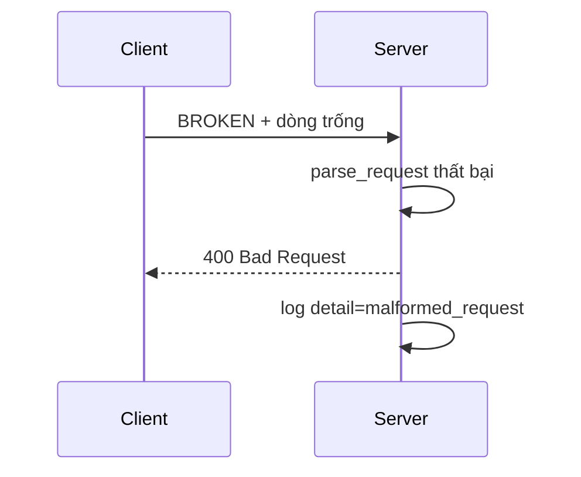
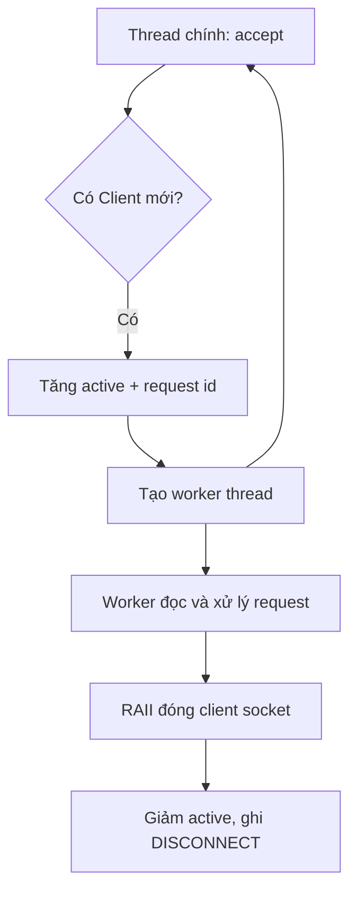
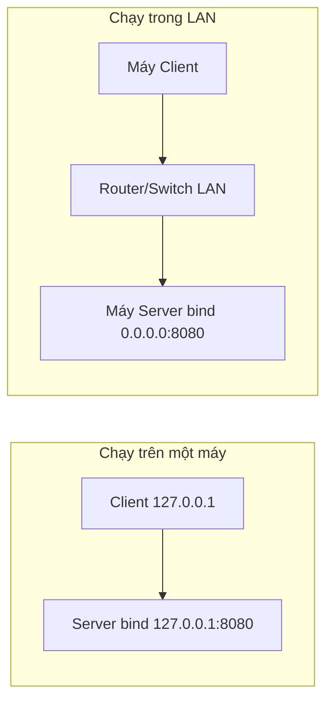

# BÁO CÁO ĐỒ ÁN LẬP TRÌNH SOCKET

# LỜI MỞ ĐẦU

Mạng máy tính cho phép các chương trình trên cùng một máy hoặc trên nhiều máy trao đổi dữ liệu. Tuy nhiên, để một chương trình có thể gửi yêu cầu, nhận kết quả và phân biệt đúng đối tác giao tiếp, người lập trình cần một giao diện kết nối giữa tầng ứng dụng và tầng vận chuyển. Socket cung cấp giao diện đó. Vì vậy, lập trình Socket là một nội dung nền tảng để hiểu cách các dịch vụ quen thuộc như Web, thư điện tử và truyền tệp hoạt động phía sau giao diện người dùng.

Đồ án SocketDemo xây dựng một Web Client và một Web Server dạng console bằng C++17 trên Windows. Hai chương trình không sử dụng thư viện HTTP cấp cao. Thay vào đó, chúng trực tiếp gọi Winsock2 để tạo kết nối TCP, tự xây dựng thông điệp HTTP, tự phân tích yêu cầu, đọc tệp và gửi phản hồi. Cách tiếp cận này giữ được trọng tâm của môn học: hiểu vòng đời Socket và giao thức ứng dụng, đồng thời tạo ra sản phẩm có thể trình diễn bằng cả Client tự viết lẫn trình duyệt Web.

Trong quá trình hoàn thiện, dự án đã được mở rộng từ Server tuần tự thành Server có thể tiếp nhận nhiều Client đồng thời, hỗ trợ chạy trong mạng LAN, ghi log đồng bộ và có bộ smoke test tự động. Báo cáo trình bày cơ sở lý thuyết, mục tiêu, yêu cầu, kiến trúc, cài đặt, kiểm thử, đối chiếu với tài liệu tham khảo và hướng phát triển. Những nội dung chưa có trong mã nguồn được ghi rõ là giới hạn hoặc đề xuất, không được xem là kết quả đã hoàn thành.

Nhóm thực hiện xin cảm ơn giảng viên hướng dẫn và các tác giả tài liệu tham khảo đã cung cấp nền tảng kiến thức cho đồ án. Những thiếu sót còn lại sẽ là cơ sở để nhóm tiếp tục cải tiến sản phẩm.

\newpage

# MỤC LỤC

1. Chương 1: Tổng quan đề tài  
2. Chương 2: Cơ sở lý thuyết  
3. Chương 3: Phân tích yêu cầu  
4. Chương 4: Phân tích và thiết kế hệ thống  
5. Chương 5: Cài đặt  
6. Chương 6: Kiểm thử và đánh giá  
7. Chương 7: Đối chiếu với yêu cầu và tài liệu Ref  
8. Chương 8: Kết quả đạt được  
9. Chương 9: Hạn chế và hướng phát triển  
10. Kết luận  
11. Tài liệu tham khảo  
12. Phụ lục

*Số trang trong mục lục được cập nhật tự động trong bản DOCX khi mở bằng Microsoft Word và chọn Update Field.*

\newpage

# CHƯƠNG 1. TỔNG QUAN ĐỀ TÀI

## 1.1. Bối cảnh và lý do chọn đề tài

Kiến trúc Client-Server xuất hiện trong phần lớn dịch vụ mạng. Client khởi tạo yêu cầu, Server tiếp nhận, xử lý và trả kết quả. Web là một ví dụ trực quan: trình duyệt gửi HTTP request tới Web Server; Server trả HTML, hình ảnh hoặc dữ liệu khác. Dù người dùng chỉ nhìn thấy một địa chỉ URL và trang hiển thị, phía dưới là chuỗi thao tác gồm phân giải địa chỉ, tạo TCP connection, gửi byte, phân tích giao thức và đóng kết nối.

Tài liệu `Socket.pdf` xác định Socket là API cho phép chương trình ứng dụng sử dụng dịch vụ của tầng vận chuyển. Tài liệu cũng trình bày đầy đủ hai nhánh TCP và UDP, trong đó mô hình TCP Client-Server đi qua các giai đoạn: Server tạo socket, bind và listen; Client tạo socket và connect; Server accept; hai bên trao đổi request/reply; cuối cùng đóng socket (`Socket.pdf`, trang 1 và 6-9).

Nhóm chọn bài toán Web Client-Web Server vì bài toán này kết hợp hai lớp kiến thức. Lớp thứ nhất là kỹ thuật Socket với Winsock2. Lớp thứ hai là giao thức ứng dụng HTTP. Sản phẩm có đầu ra dễ quan sát, chạy được trên localhost, mạng LAN và tương thích với trình duyệt ở mức phục vụ file tĩnh. So với ví dụ chỉ gửi một số nguyên hoặc một chuỗi chat, HTTP giúp minh họa rõ hơn việc thiết kế định dạng thông điệp và tuân thủ quy tắc giao tiếp.

## 1.2. Bài toán cần giải quyết

Bài toán đặt ra là xây dựng hai chương trình độc lập:

- Web Client nhận `host`, `port` và `path`, kết nối đến Server bằng TCP, tự tạo HTTP GET request, gửi request và hiển thị response.
- Web Server lắng nghe tại địa chỉ và cổng cấu hình, chấp nhận kết nối, đọc request HTTP, kiểm tra tính hợp lệ, đọc tệp trong document root và trả HTTP response.
- Server phải phân biệt được yêu cầu thành công, yêu cầu sai, phương thức không hỗ trợ và tệp không tồn tại.
- Server phải có giới hạn cơ bản đối với kích thước header và đường dẫn để giảm nguy cơ đọc tệp ngoài thư mục cho phép.
- Nhiều Client phải có thể kết nối đồng thời trong quy mô demo.
- Hệ thống phải có log và kiểm thử tự động để chứng minh hành vi.

## 1.3. Mục tiêu tổng quát

Mục tiêu tổng quát là vận dụng kiến thức Socket để xây dựng một hệ thống Client-Server hoàn chỉnh, trong đó dữ liệu được truyền qua TCP theo một giao thức ứng dụng có cấu trúc. Sản phẩm cần thể hiện rõ vai trò của IP, port, listening socket, connected socket, request, response và quá trình giải phóng tài nguyên.

## 1.4. Mục tiêu cụ thể

1. Sử dụng trực tiếp Winsock2 trên Windows và quản lý vòng đời `WSAStartup`/`WSACleanup`.
2. Cài đặt đúng chuỗi thao tác TCP phía Server và Client.
3. Cài đặt một tập con có kiểm soát của HTTP/1.1, tập trung vào `GET`.
4. Phục vụ tệp tĩnh với MIME type phù hợp.
5. Trả các mã `200`, `400`, `404`, `405` và header tối thiểu.
6. Xử lý nhiều kết nối đồng thời bằng thread-per-client.
7. Hỗ trợ localhost và LAN bằng tham số bind address.
8. Ghi log thread-safe và xây dựng smoke test tự động.
9. Tổ chức mã nguồn thành module dùng chung, Server, Client và website mẫu.

## 1.5. Đối tượng, phạm vi và giới hạn

Đối tượng nghiên cứu là Socket API trên Windows, giao thức TCP, mô hình Client-Server và cấu trúc cơ bản của HTTP. Phạm vi sản phẩm là Web Server phục vụ file tĩnh và Web Client console. Dự án không hướng tới thay thế Web Server sản xuất như IIS, Apache hoặc Nginx.

Phiên bản hiện tại chỉ hỗ trợ một request trên mỗi kết nối và luôn trả `Connection: close`. Server chưa có timeout, giới hạn thread, graceful shutdown, TLS hoặc xác thực. Các giới hạn này được chấp nhận trong phạm vi đồ án học tập, nhưng phải được nêu rõ khi đánh giá khả năng triển khai thực tế.

## 1.6. Kết quả dự kiến

Kết quả mong đợi gồm mã nguồn C++17, hai executable, website mẫu, hướng dẫn build/chạy, log hoạt động và bộ kiểm thử. Khi demo, người dùng có thể khởi động Server, dùng Client lấy `/index.html`, lấy `/hello.txt`, thử đường dẫn không tồn tại và mở cùng trang bằng trình duyệt.

## Tiểu kết chương 1

Chương 1 đã xác định bài toán, mục tiêu và phạm vi. Trọng tâm không phải xây dựng Web Server đầy đủ tính năng mà là chứng minh khả năng lập trình Client-Server bằng Socket, đồng thời tổ chức giao tiếp theo HTTP rút gọn.

\newpage

# CHƯƠNG 2. CƠ SỞ LÝ THUYẾT

## 2.1. Mạng máy tính và mô hình Client-Server

Mạng máy tính là tập hợp các thiết bị có khả năng trao đổi dữ liệu qua môi trường truyền dẫn và các giao thức thống nhất. Trong mô hình Client-Server, Server cung cấp dịch vụ tại một địa chỉ đã biết; Client chủ động liên hệ để sử dụng dịch vụ. Một Server có thể phục vụ nhiều Client, còn một Client có thể làm việc với nhiều Server khác nhau.

Vai trò Client và Server được xác định theo phiên giao tiếp, không nhất thiết theo loại máy. Trong SocketDemo, `socket_server.exe` giữ vai trò thụ động ban đầu: bind vào địa chỉ/cổng và chờ kết nối. `socket_client.exe` giữ vai trò chủ động: biết host, port và gọi `connect`. Sau khi kết nối hình thành, cả hai đầu đều có thể gửi và nhận byte, nhưng giao thức HTTP quy định Client gửi request trước và Server trả response sau.

## 2.2. Khái niệm Socket

Socket là giao diện lập trình giữa chương trình ứng dụng và tầng vận chuyển. Có thể hình dung socket như một đầu mút giao tiếp. Một đầu mút Internet thường được nhận diện bởi cặp địa chỉ IP và port. Địa chỉ IP xác định máy hoặc giao diện mạng; port giúp hệ điều hành chuyển dữ liệu đến đúng tiến trình trên máy đó.

Socket không đồng nghĩa với TCP và cũng không đồng nghĩa với HTTP. Socket là API/đối tượng lập trình. TCP là giao thức tầng vận chuyển. HTTP là giao thức tầng ứng dụng. Trong dự án:

- Winsock2 cung cấp API Socket.
- Socket được tạo với `SOCK_STREAM` và `IPPROTO_TCP`, nên tầng vận chuyển là TCP.
- Byte truyền qua TCP được tổ chức theo cú pháp HTTP/1.1 rút gọn.

Sự phân biệt này quan trọng vì cùng một API Socket có thể dùng UDP, và cùng TCP có thể mang HTTP, FTP hoặc giao thức tự thiết kế.

## 2.3. Winsock2 trên Windows

Winsock là triển khai Socket API của Windows. Trước khi gọi các hàm Socket, chương trình phải khởi tạo thư viện bằng `WSAStartup`. Sau khi hoàn tất, chương trình gọi `WSACleanup`. SocketDemo đóng gói hai thao tác này trong lớp RAII `WsaSession`: constructor gọi `WSAStartup(MAKEWORD(2,2))`, destructor gọi `WSACleanup` (`src/common/socket_support.cpp`, dòng 10-25).

Liên kết với thư viện `ws2_32` được cấu hình trong CMake (`CMakeLists.txt`, dòng 16-22). Cách đóng gói bằng RAII giúp giải phóng tài nguyên khi thoát khỏi scope, kể cả khi có exception.

## 2.4. Địa chỉ IP, localhost, LAN và port

IPv4 biểu diễn địa chỉ bằng 32 bit, thường viết thành bốn số thập phân. Địa chỉ `127.0.0.1` là loopback, chỉ truy cập trong chính máy hiện tại. Đây là giá trị mặc định an toàn của Server. Địa chỉ `0.0.0.0` khi dùng để bind mang nghĩa lắng nghe trên tất cả giao diện IPv4 của máy. Nhờ đó máy khác trong LAN có thể kết nối qua địa chỉ IPv4 thật của máy Server, nếu định tuyến và Windows Firewall cho phép.

Port có phạm vi 0-65535, nhưng port 0 thường dùng để yêu cầu hệ điều hành tự chọn và không được SocketDemo chấp nhận làm tham số Server. Dự án mặc định sử dụng port 8080 để tránh phụ thuộc đặc quyền của port 80 và giảm xung đột với Web Server đã cài trên máy.

Trên đường truyền, số nguyên nhiều byte phải chuyển sang network byte order. Server dùng `htons(port)` trước khi bind; khi log port Client, Server dùng `ntohs` (`src/server/main.cpp`, dòng 267-300).

## 2.5. TCP

TCP là giao thức hướng kết nối. Trước khi truyền dữ liệu ứng dụng, hai đầu thiết lập connection. TCP cung cấp luồng byte có thứ tự và cơ chế phát hiện lỗi, xác nhận, truyền lại. Ứng dụng không nhận được ranh giới message tự động. Một lần `send` không bảo đảm tương ứng với một lần `recv`, và một lần `recv` có thể chỉ trả một phần dữ liệu.

Đặc tính luồng byte giải thích vì sao dự án có hàm `send_all`. Hàm lặp cho đến khi tổng số byte đã gửi bằng kích thước yêu cầu, thay vì giả định một lời gọi `send` gửi hết (`src/common/socket_support.cpp`, dòng 75-92). Phía Server đọc header theo từng khối 2048 byte cho tới khi thấy chuỗi kết thúc `\r\n\r\n` (`src/server/main.cpp`, dòng 65-87).

### 2.5.1. Bắt tay TCP

Quá trình thiết lập TCP thường được mô tả bằng ba bước SYN, SYN-ACK và ACK. Winsock thực hiện chi tiết này trong hệ điều hành. Ở mức ứng dụng, Client quan sát bằng lời gọi `connect`, còn Server quan sát khi `accept` trả về connected socket. Listening socket tiếp tục dùng để nhận kết nối mới; connected socket dùng để trao đổi dữ liệu với một Client cụ thể.

### 2.5.2. Đóng kết nối

Khi một đầu đóng socket, TCP thực hiện quá trình kết thúc kết nối. Trong mô hình HTTP của dự án, Server trả `Connection: close`; đối tượng `net::Socket` tự gọi `closesocket` trong destructor (`src/common/socket_support.cpp`, dòng 27-55). Client đọc tới khi `recv` trả 0, xem đó là dấu hiệu Server đã đóng luồng sau response (`src/client/main.cpp`, dòng 59-75).

## 2.6. UDP và so sánh với TCP

UDP là giao thức không kết nối. Dữ liệu được trao đổi dưới dạng datagram bằng `sendto`/`recvfrom`; mỗi datagram giữ ranh giới message nhưng UDP không tự bảo đảm giao hàng, thứ tự hoặc truyền lại. `Socket.pdf` trình bày TCP ở trang 6-9 và UDP ở trang 10-11.

| Tiêu chí | TCP | UDP |
|---|---|---|
| Kết nối | Có thiết lập connection | Không thiết lập connection |
| Dạng dữ liệu | Luồng byte | Datagram |
| Độ tin cậy | Có thứ tự, truyền lại khi cần | Best effort |
| Chi phí | Cao hơn | Thấp hơn |
| API điển hình | `connect`, `accept`, `send`, `recv` | `sendto`, `recvfrom` |
| Phù hợp | Web, truyền tệp, dữ liệu cần chính xác | Streaming thời gian thực, discovery, telemetry |
| SocketDemo | Đang sử dụng | Chưa cài đặt |

HTTP truyền thống hoạt động trên TCP, vì vậy lựa chọn TCP của SocketDemo phù hợp với bài toán. Việc chưa có UDP không làm sai mục tiêu Web Server, nhưng một module UDP nhỏ có thể giúp đồ án bao phủ đầy đủ tài liệu môn học.

## 2.7. Blocking, non-blocking và xử lý đồng thời

Socket blocking khiến lời gọi như `accept` hoặc `recv` chờ cho đến khi có sự kiện hoặc lỗi. Mô hình này dễ hiểu và phù hợp với ứng dụng console nhỏ. Vấn đề xuất hiện khi một Client kết nối nhưng gửi chậm: thread xử lý có thể bị giữ tại `recv`.

SocketDemo dùng blocking socket kết hợp thread-per-client. Thread chính chờ `accept`; sau mỗi kết nối, socket Client được chuyển vào một thread mới, rồi vòng lặp chính quay lại `accept` (`src/server/main.cpp`, dòng 287-329). Nhờ vậy một Client không chặn việc chấp nhận Client tiếp theo.

Tài liệu và demo `WSAAsyncSelect` trong `Ref` trình bày hướng khác: chuyển socket sang non-blocking và nhận sự kiện Windows như `FD_ACCEPT`, `FD_READ`, `FD_CLOSE`. Hướng này đặc biệt phù hợp với MFC vì không làm treo UI. SocketDemo chưa dùng hướng đó; lựa chọn thread phù hợp với giao diện console hiện tại.

## 2.8. Byte stream, buffer và gửi/nhận thiếu dữ liệu

TCP không bảo đảm một message ứng dụng được nhận trọn trong một `recv`. Do đó ứng dụng cần quy tắc framing. HTTP dùng dòng trống để kết thúc header và dùng `Content-Length` để mô tả body. Server hiện chỉ cần request header của GET nên đọc đến `\r\n\r\n`. Client hiện đọc toàn bộ response đến khi connection đóng, phù hợp với `Connection: close`.

Buffer phải có kích thước hữu hạn và ứng dụng phải đặt giới hạn tổng. Server giới hạn header 16 KB để tránh Client gửi vô hạn. Client giới hạn response 10 MB để tránh tiêu thụ bộ nhớ không kiểm soát trong bản demo. Đây là giới hạn ứng dụng, không phải giới hạn của TCP.

## 2.9. HTTP/1.1

HTTP là giao thức tầng ứng dụng theo mô hình request-response. Slide `06 - Web Server.pdf` mô tả HTTP sử dụng TCP, Web Client gửi request và Web Server trả đối tượng (`06 - Web Server.pdf`, trang 8-12). Một HTTP request cơ bản gồm request line, các header và dòng trống. Ví dụ:

```http
GET /index.html HTTP/1.1
Host: 127.0.0.1:8080
User-Agent: SocketDemo-Client/1.0
Accept: */*
Connection: close

```

Response gồm status line, các header, dòng trống và body:

```http
HTTP/1.1 200 OK
Server: SocketDemo/1.0
Content-Length: 74
Content-Type: text/plain; charset=utf-8
Connection: close

Hello from SocketDemo!
This file was served by a C++ Winsock HTTP server.
```

### 2.9.1. Phương thức

`GET` yêu cầu biểu diễn của tài nguyên. `HEAD` giống GET nhưng không trả body. `POST` thường gửi dữ liệu trong request body để Server xử lý. SocketDemo chỉ cài đặt GET. Nếu parser nhận phương thức hợp lệ nhưng khác GET, Server trả `405 Method Not Allowed` và header `Allow: GET` (`src/server/main.cpp`, dòng 184-190).

### 2.9.2. Mã trạng thái

- `200 OK`: yêu cầu thành công và body chứa tệp.
- `400 Bad Request`: request sai cú pháp, thiếu `Host`, header không đầy đủ/quá lớn hoặc đường dẫn không an toàn.
- `404 Not Found`: tệp không tồn tại hoặc không phải regular file.
- `405 Method Not Allowed`: Server hiểu phương thức nhưng không hỗ trợ phương thức đó cho tài nguyên.

Các mã `408` và `503` chưa được cài đặt. Chúng chỉ được nêu trong hướng phát triển.

### 2.9.3. Header quan trọng

`Content-Length` cho biết số byte body. `Content-Type` cho biết loại dữ liệu. `Connection: close` thông báo kết nối sẽ đóng sau response. `Host` là header bắt buộc trong request HTTP/1.1 theo tập quy tắc parser của dự án. `Server` mô tả phần mềm phản hồi.

### 2.9.4. MIME type

MIME type giúp Client hiểu cách xử lý body. Module HTTP ánh xạ các phần mở rộng như `.html`, `.txt`, `.css`, `.js`, `.json`, `.svg`, `.png`, `.jpg`, `.gif`, `.ico`; loại không biết dùng `application/octet-stream` (`src/common/http.cpp`, dòng 95-107).

### 2.9.5. Non-persistent và persistent connection

Non-persistent HTTP dùng một connection cho một request/response rồi đóng. Persistent connection cho phép nhiều request/response trên cùng connection. Dự án chọn non-persistent đơn giản dù request line là HTTP/1.1. Quyết định này giảm độ phức tạp framing, timeout và quản lý trạng thái, phù hợp demo nhưng kém hiệu quả khi một trang có nhiều tài nguyên.

## 2.10. Directory traversal và giới hạn header

Directory traversal xảy ra khi Client sử dụng đường dẫn như `/../secret.txt` để thoát khỏi document root. SocketDemo từ chối target chứa `..`, `\`, `:`, target không bắt đầu bằng `/` hoặc bắt đầu bằng `//`. Query và fragment được loại trước khi ánh xạ tệp. Đây là lớp bảo vệ cơ bản.

Cơ chế hiện tại chưa canonicalize và kiểm tra prefix của đường dẫn chuẩn hóa. Với tập ký tự bị chặn và không có URL decoding, nó phù hợp phạm vi demo. Nếu thêm percent-decoding trong tương lai, cần canonicalize đường dẫn sau decode và xác nhận đường dẫn cuối vẫn nằm trong document root.

## 2.11. Vòng đời Server và Client

Vòng đời TCP Server của dự án:

```text
WSAStartup -> socket -> setsockopt -> bind -> listen
           -> accept -> recv -> parse -> read file -> send
           -> closesocket(client) -> lặp accept
```

Vòng đời Client:

```text
WSAStartup -> getaddrinfo -> socket -> connect
           -> build GET -> send -> recv đến EOF
           -> hiển thị response -> closesocket
```

Các bước này khớp với mô hình trong `Socket.pdf`, chỉ khác tên hàm `send`/`recv` thay cho cách gọi khái quát `write`/`read`.

## Tiểu kết chương 2

Chương 2 đã phân biệt Socket, TCP và HTTP; trình bày địa chỉ, port, luồng byte, blocking và bảo vệ cơ bản. Những khái niệm này giải thích trực tiếp các quyết định cài đặt trong SocketDemo.

\newpage

# CHƯƠNG 3. PHÂN TÍCH YÊU CẦU

## 3.1. Tác nhân

Hệ thống có ba tác nhân chính. Người vận hành Server chọn port, document root và bind address. Người dùng Client chọn host, port và path. Trình duyệt là một Client HTTP bên ngoài dùng để kiểm chứng tính tương thích của Server.

## 3.2. Yêu cầu chức năng

| Mã | Yêu cầu | Mức ưu tiên |
|---|---|---|
| FR-01 | Server khởi tạo Winsock và listening socket TCP | Bắt buộc |
| FR-02 | Server bind địa chỉ/cổng và lắng nghe kết nối | Bắt buộc |
| FR-03 | Client phân giải host và kết nối Server | Bắt buộc |
| FR-04 | Client tạo và gửi HTTP GET request | Bắt buộc |
| FR-05 | Server đọc và phân tích HTTP request | Bắt buộc |
| FR-06 | Server phục vụ file trong document root | Bắt buộc |
| FR-07 | Server trả `200/400/404/405` | Bắt buộc |
| FR-08 | Server trả Content-Length, Content-Type, Connection | Bắt buộc |
| FR-09 | Server xử lý nhiều Client đồng thời | Nâng cao |
| FR-10 | Server ghi log console và file | Nâng cao |
| FR-11 | Server chạy localhost hoặc LAN qua bind address | Nâng cao |
| FR-12 | Có website mẫu và smoke test | Nâng cao |

## 3.3. Yêu cầu phi chức năng

- Mã nguồn sử dụng C++17, tổ chức theo module và build bằng CMake.
- Mọi socket phải được đóng tự động khi đối tượng ra khỏi scope.
- Log từ nhiều thread không được xen byte làm hỏng dòng.
- Header request không vượt 16 KB.
- Client không giữ response quá 10 MB.
- Đường dẫn không được thoát document root bằng chuỗi traversal trực tiếp.
- Giá trị mặc định chỉ bind localhost; LAN phải được bật chủ động.
- Bản demo ưu tiên dễ hiểu, chạy ổn định và có thể trình bày trong thời gian ngắn.

## 3.4. Trường hợp sử dụng

### UC-01: Lấy tệp hợp lệ

Điều kiện đầu: Server đang chạy, tệp tồn tại trong document root. Client kết nối và gửi GET. Server phân tích request, đọc tệp, tạo response `200` và đóng connection. Client hiển thị header và body.

### UC-02: Tệp không tồn tại

Client gửi GET tới path hợp lệ nhưng không có tệp tương ứng. Server trả `404 Not Found` với body văn bản.

### UC-03: Request sai

Client gửi request line sai, thiếu `Host`, header hỏng, header quá lớn hoặc target không an toàn. Server trả `400 Bad Request` nếu còn khả năng gửi response.

### UC-04: Phương thức không hỗ trợ

Client gửi `POST`. Parser chấp nhận request line và header, nhưng lớp xử lý nghiệp vụ phát hiện phương thức khác GET. Server trả `405` và `Allow: GET`.

### UC-05: Nhiều Client đồng thời

Nhiều Client kết nối trước khi gửi request. Vòng accept tạo thread riêng cho từng connection. Bộ đếm `active_connections` phản ánh số connection đang hoạt động và log chứng minh mức đồng thời.

### UC-06: Truy cập qua LAN

Người vận hành chạy Server với bind address `0.0.0.0`. Máy khác cùng LAN dùng địa chỉ IPv4 của máy Server. Windows Firewall có thể yêu cầu cho phép ứng dụng trên mạng riêng.

## 3.5. Điều kiện lỗi và đầu ra

| Điều kiện | Hành vi mong đợi |
|---|---|
| Port ngoài 1-65535 | Chương trình báo lỗi và thoát mã 1 |
| Document root không tồn tại | Server báo lỗi và không listen |
| Bind address không phải IPv4 | Server báo lỗi |
| Không tạo/bind/listen được | Ghi lỗi fatal và thoát |
| Client không phân giải host | Báo lỗi phân giải |
| Client không connect được | Báo lỗi kết nối |
| Request thiếu Host | `400 Bad Request` |
| Path có `..` | `400 Bad Request` |
| Tệp không tồn tại | `404 Not Found` |
| Phương thức POST | `405 Method Not Allowed` |

## 3.6. Tiêu chí hoàn thành

Dự án được xem là đạt MVP khi build thành công, hai chương trình chạy độc lập, Client lấy được tệp, Server trả đúng lỗi cơ bản và trình duyệt truy cập được. Bản hiện tại vượt MVP nhờ đa client, LAN, log và kiểm thử tự động. Tuy nhiên, chưa thể gọi là production-ready vì thiếu giới hạn tài nguyên, timeout và shutdown có kiểm soát.

## 3.7. Truy vết yêu cầu

| Yêu cầu | Mã nguồn | Kiểm thử |
|---|---|---|
| FR-01/02 | `src/server/main.cpp:257-280` | Server khởi động trong smoke test |
| FR-03/04 | `src/client/main.cpp:26-109` | GET index và hello |
| FR-05 | `src/common/http.cpp:23-71` | malformed request |
| FR-06 | `src/server/main.cpp:193-221` | index/hello/404 |
| FR-07/08 | `src/server/main.cpp:165-221`, `src/common/http.cpp:74-92` | status checks |
| FR-09 | `src/server/main.cpp:301-329` | 10 Client đồng thời |
| FR-10 | `src/server/main.cpp:23-52` | log đủ dòng, không hỏng |
| FR-11 | `src/server/main.cpp:238-271` | Hướng dẫn thủ công LAN |
| FR-12 | `www`, `tests/smoke_test.ps1` | 34/34 checks |

## Tiểu kết chương 3

Các yêu cầu đã được chuyển thành hành vi quan sát được và liên kết với mã nguồn, kiểm thử. Cách truy vết này giúp phân biệt kết quả hiện hữu với kế hoạch tương lai.

\newpage

# CHƯƠNG 4. PHÂN TÍCH VÀ THIẾT KẾ HỆ THỐNG

## 4.1. Kiến trúc tổng thể

SocketDemo dùng kiến trúc phân lớp nhỏ. Client và Server là hai executable. Module `common/socket_support` quản lý Winsock, socket RAII và gửi đủ dữ liệu. Module `common/http` phân tích request, tạo response header và xác định MIME type. Server sử dụng các module chung để phục vụ file trong `www`.



## 4.2. Cấu trúc thư mục

```text
SocketDemo/
|-- CMakeLists.txt
|-- README.md
|-- src/
|   |-- client/main.cpp
|   |-- server/main.cpp
|   `-- common/
|       |-- http.h / http.cpp
|       `-- socket_support.h / socket_support.cpp
|-- tests/smoke_test.ps1
|-- www/index.html
|-- www/hello.txt
`-- docs/
```

## 4.3. Trách nhiệm thành phần

### Server

Server đọc tham số, xác nhận document root, mở log, khởi tạo Winsock, tạo listening socket, bind, listen và lặp accept. Mỗi accepted socket được chuyển quyền sở hữu vào lambda của thread. Hàm `handle_client` chịu trách nhiệm đọc header, phân tích, kiểm tra method/path, đọc tệp và gửi response.

### Client

Client xác thực số tham số và port, chuẩn hóa path, phân giải host bằng `getaddrinfo`, thử kết nối qua danh sách địa chỉ, tạo GET request, gửi đủ byte, đọc response tới EOF và tách header/body để hiển thị.

### HTTP module

Module HTTP không thao tác socket. Nó chỉ xử lý dữ liệu: parser yêu cầu đúng ba thành phần request line, method chữ hoa, target bắt đầu `/`, version `HTTP/1.1`, header có dấu hai chấm và có `Host`. Response builder tạo header chuẩn của dự án.

### Socket support

Module này đóng gói tài nguyên hệ thống. `WsaSession` quản lý thư viện Winsock. `Socket` không cho copy nhưng cho move, nhờ đó quyền sở hữu accepted socket được chuyển an toàn vào thread. `send_all` xử lý partial send.

### Document root

`www` là vùng tệp được phép công bố. Target `/` được ánh xạ thành `/index.html`. Target khác bỏ ký tự `/` đầu và nối với root. Query/fragment không tham gia chọn tệp.

## 4.4. Luồng GET thành công



## 4.5. Luồng tệp không tồn tại



## 4.6. Luồng request sai



## 4.7. Xử lý nhiều Client



Ưu điểm của thread-per-client là đơn giản, dễ quan sát và phù hợp demo. Nhược điểm là mỗi connection tiêu thụ một thread hệ điều hành. Client chậm có thể giữ thread vô hạn vì chưa có receive timeout. Detached thread cũng làm shutdown khó kiểm soát.

## 4.8. Logger và thống kê

Logger tạo trọn dòng trước, sau đó giữ mutex trong lúc ghi ra `std::cout` và file. Nhờ vậy log từ nhiều thread không xen vào nhau. Mỗi request có id, endpoint, method, path, status, byte body, thời gian xử lý và số connection active. `total_requests` và `active_connections` là atomic (`src/server/main.cpp`, dòng 23-57 và 146-158).

Tên `total_requests` hiện hơi rộng hơn ý nghĩa thực tế vì bộ đếm tăng ngay sau `accept`, kể cả connection đóng mà chưa gửi request. Trong báo cáo nên hiểu request id là connection/request attempt id.

## 4.9. Ánh xạ URL thành tệp

Quy trình gồm: loại query/fragment, kiểm tra target an toàn, đổi `/` thành `/index.html`, bỏ slash đầu và nối document root. Server dùng `is_regular_file` để tránh trả thư mục. File được đọc ở chế độ binary nên có thể phục vụ cả văn bản và hình ảnh.

## 4.10. Triển khai localhost và LAN



Bind `127.0.0.1` giảm bề mặt truy cập và là mặc định. Bind `0.0.0.0` mở dịch vụ trên các card mạng; người dùng cần dùng IP thật của máy Server và chỉ cho phép Firewall trong mạng tin cậy.

## 4.11. Các quyết định thiết kế

| Quyết định | Lợi ích | Đánh đổi |
|---|---|---|
| Console thay MFC | Hoàn thiện lõi Socket nhanh, dễ build | Chưa có UI trực quan |
| TCP + HTTP | Bám bài toán Web, đáng tin cậy | Không minh họa UDP |
| Connection close | Framing Client đơn giản | Tạo connection mới mỗi request |
| Thread-per-client | Dễ hiểu, có đồng thời | Không giới hạn tài nguyên |
| Parser rút gọn | Dễ kiểm thử và trình bày | Không phải HTTP server đầy đủ |
| RAII | Hạn chế rò rỉ socket | Cần hiểu move semantics |

## Tiểu kết chương 4

Kiến trúc tách rõ giao tiếp mạng, HTTP và xử lý tệp. Luồng chính bám sát mô hình Client-Server trong tài liệu. Mô hình đồng thời hiện tại phù hợp demo nhưng là điểm cần nâng cấp trước khi chịu tải lớn.

\newpage

# CHƯƠNG 5. CÀI ĐẶT

## 5.1. Công nghệ

- Ngôn ngữ C++17.
- Winsock2 và thư viện `ws2_32`.
- TCP/IPv4 cho Server; Client dùng `AF_UNSPEC` khi phân giải nhưng kết nối tới Server hiện cấu hình IPv4.
- HTTP/1.1 rút gọn.
- CMake và Ninja.
- MinGW-w64 g++.
- PowerShell cho smoke test.

## 5.2. Quy trình build

```powershell
cmake -S . -B build -G Ninja -DCMAKE_CXX_COMPILER=C:/msys64/ucrt64/bin/g++.exe
cmake --build build
```

CMake tạo thư viện `socket_common`, liên kết `ws2_32`, tạo hai executable và copy `www` sang build sau khi build Server (`CMakeLists.txt`, dòng 14-39).

## 5.3. Khởi tạo Winsock và RAII

```cpp
WsaSession::WsaSession() {
    WSADATA data{};
    const int result = WSAStartup(MAKEWORD(2, 2), &data);
    if (result != 0) {
        throw std::runtime_error("WSAStartup failed");
    }
}

WsaSession::~WsaSession() {
    WSACleanup();
}
```

Lớp `Socket` giữ một `SOCKET`, cấm copy và hỗ trợ move. Destructor gọi `closesocket`. Khi accepted socket được capture bằng `client = std::move(client)`, socket ở thread chính trở thành invalid và worker trở thành chủ sở hữu duy nhất.

## 5.4. Cài đặt Server

### 5.4.1. Tham số dòng lệnh

```text
socket_server [port] [document_root] [bind_address]
```

Mặc định là port `8080`, root `www`, bind `127.0.0.1`. Server chỉ chấp nhận tối đa ba tham số và xác thực port 1-65535. `document_root` được chuyển thành đường dẫn tuyệt đối và phải là thư mục. `bind_address` phải là IPv4 mà `inet_pton` chấp nhận.

### 5.4.2. Listening socket

Server tạo socket bằng `socket(AF_INET, SOCK_STREAM, IPPROTO_TCP)`, bật `SO_REUSEADDR`, điền `sockaddr_in`, gọi `bind` và `listen(SOMAXCONN)`. `SO_REUSEADDR` hỗ trợ khởi động lại thuận tiện trong môi trường demo, nhưng không thay thế shutdown đúng cách.

### 5.4.3. Accept và worker

Vòng lặp vô hạn gọi `accept`. Sau khi kết nối thành công, Server lấy IP/port Client bằng `inet_ntop` và `ntohs`, cập nhật atomic counter, log CONNECT rồi tạo thread. Worker gọi `handle_client`, bắt exception, giảm active và log DISCONNECT.

### 5.4.4. Đọc header

`read_header` dùng buffer 2048 byte và nối vào `std::string`. Vòng lặp dừng khi thấy `\r\n\r\n`, khi connection đóng, khi có lỗi hoặc khi vượt `kMaxHeaderSize`. Header không hoàn chỉnh nhưng có dữ liệu được trả `400`.

### 5.4.5. Phân tích request

Parser tách request line thành đúng ba token. Method phải gồm chữ hoa; target bắt đầu `/`; version phải bằng `HTTP/1.1`. Mỗi header line phải có tên token hợp lệ và dấu `:`. Phải có `Host` không rỗng. Parser chỉ trả hai trạng thái `ok` và `bad_request`, phù hợp tập mã lỗi hiện tại.

### 5.4.6. Đọc và trả file

Sau kiểm tra method/path, Server kiểm tra `is_regular_file`, đọc tệp bằng `ifstream` binary và vector char. `mime_type` chọn Content-Type. `response_header` xây status/header, còn `send_response` gửi header và body bằng `send_all`.

## 5.5. Cài đặt Client

### 5.5.1. Tham số

```text
socket_client <host> <port> <path>
```

Client yêu cầu đúng ba tham số. Nếu path không bắt đầu bằng `/`, chương trình tự thêm. Port được xác thực như phía Server.

### 5.5.2. Phân giải và kết nối

Client dùng `getaddrinfo` với `SOCK_STREAM` và `IPPROTO_TCP`. Chương trình lặp qua các địa chỉ được trả về, tạo candidate socket và gọi `connect` cho đến khi thành công. Danh sách được giải phóng bằng `freeaddrinfo`.

### 5.5.3. Tạo request

Request có `GET`, `Host`, `User-Agent`, `Accept` và `Connection: close`. Đây là bằng chứng Client tự cài đặt giao thức ứng dụng thay vì gọi một thư viện HTTP.

### 5.5.4. Nhận response

Client lặp `recv` đến khi nhận 0. Tổng dữ liệu bị giới hạn 10 MB. Sau đó Client tìm `\r\n\r\n`, in phần trước là header và phần sau là body. Client chưa kiểm tra `Content-Length` hoặc giải mã chunked transfer encoding; điều này chấp nhận được khi làm việc với Server của dự án luôn đóng kết nối và không gửi chunked.

## 5.6. Xử lý lỗi

Các lỗi setup nghiêm trọng được chuyển thành exception và in `[FATAL]` hoặc `[ERROR]`. Worker bắt exception để một Client không làm kết thúc toàn bộ Server. `net::error_message` dùng `FormatMessageA` để chuyển mã Winsock thành chuỗi dễ đọc.

Một hạn chế là lỗi `send_response` không được dùng để thay đổi log status; log có thể ghi status dự định dù Client đóng sớm làm send thất bại. Phiên bản sau nên ghi thêm `send_ok` hoặc byte thực gửi.

## 5.7. Chạy localhost

```powershell
cd build
./socket_server.exe
./socket_client.exe 127.0.0.1 8080 /index.html
./socket_client.exe 127.0.0.1 8080 /hello.txt
./socket_client.exe 127.0.0.1 8080 /missing.txt
```

Trình duyệt truy cập `http://127.0.0.1:8080/index.html`.

## 5.8. Chạy LAN

```powershell
./socket_server.exe 8080 www 0.0.0.0
ipconfig
./socket_client.exe <SERVER_IP> 8080 /index.html
```

Chỉ nên cho phép Windows Firewall trên profile mạng riêng đáng tin cậy. Dự án không tự sửa firewall rule.

## Tiểu kết chương 5

Phần cài đặt thể hiện đầy đủ vòng đời Winsock/TCP và giao thức HTTP rút gọn. Cấu trúc RAII và module dùng chung giúp mã nguồn rõ hơn các demo đơn tệp, nhưng Client/Server vẫn đủ trực tiếp để quan sát các API Socket cốt lõi.

\newpage

# CHƯƠNG 6. KIỂM THỬ VÀ ĐÁNH GIÁ

## 6.1. Môi trường kiểm thử

- Hệ điều hành: Windows tại máy phát triển.
- CMake 4.2.3.
- MinGW g++ 15.2.0.
- Build directory: `SocketDemo/build`.
- Cổng smoke test: 18080.
- Ngày chạy xác nhận: 29/06/2026.

## 6.2. Phương pháp

Kiểm thử kết hợp ba mức. Build check xác nhận cấu hình và liên kết. Smoke test khởi động Server, dùng executable Client và `TcpClient` gửi raw request, sau đó kiểm tra response/log. Kiểm thử thủ công bằng trình duyệt và LAN được dùng cho hành vi ngoài phạm vi script.

Script tự dọn Server bằng `finally`, nhưng dùng `Stop-Process -Force`; do đó ca “khởi động lại cùng port” xác nhận khả năng tái sử dụng cổng, chưa xác nhận graceful shutdown.

## 6.3. Bảng test case

| Mã | Mục tiêu | Đầu vào | Kết quả mong đợi | Kết quả thực tế | Trạng thái |
|---|---|---|---|---|---|
| TC-01 | Lấy trang HTML | GET `/index.html` | 200 và nội dung website | Đúng | Đạt |
| TC-02 | Lấy file text | GET `/hello.txt` | 200 và chuỗi Hello | Đúng | Đạt |
| TC-03 | Tệp thiếu | GET `/missing.txt` | 404 | Đúng | Đạt |
| TC-04 | Request hỏng | `BROKEN` | 400 | Đúng | Đạt |
| TC-05 | Method không hỗ trợ | POST `/index.html` | 405 | Đúng | Đạt |
| TC-06 | Traversal | GET `/../secret.txt` | 400 | Đúng | Đạt |
| TC-07 | Header lớn | Header hơn 16 KB | 400 | Đúng | Đạt |
| TC-08 | 10 Client đồng thời | 10 connection giữ mở | active >= 10 | Đúng | Đạt |
| TC-09 | Response song song | 10 GET hello | Tất cả 200, đúng body | Đúng | Đạt |
| TC-10 | Log thành công | Các request 200 | Có ít nhất 12 log 200 | Đúng | Đạt |
| TC-11 | Log từ chối | Request lỗi | Có ít nhất 3 log 400 | Đúng | Đạt |
| TC-12 | Log không trộn | Nhiều worker ghi đồng thời | Mọi dòng đúng mẫu | Đúng | Đạt |
| TC-13 | Khởi động lại | Dừng cưỡng bức, chạy cùng port | GET tiếp tục 200 | Đúng | Đạt |
| TC-14 | Trình duyệt | URL localhost | Hiển thị trang | Cần ảnh minh chứng | Thủ công |
| TC-15 | LAN hai máy | Bind 0.0.0.0 | Máy khác nhận trang | Chưa chạy trong lần kiểm tra | Chưa xác nhận |

## 6.4. Kết quả smoke test

Kết quả chạy ngày 29/06/2026: **34/34 smoke checks passed**. Số 34 lớn hơn số dòng test case vì mỗi Client song song được kiểm tra riêng status và body. Log cho thấy nhiều request có `active=10`, chứng minh các connection cùng tồn tại trước khi gửi request.

Ví dụ log đã ghi:

```text
2026-06-29 22:45:22 [REQUEST] id=8 client=127.0.0.1:62060
method=GET path=/hello.txt status=200 bytes=74 duration_ms=127 active=10
```

## 6.5. Đánh giá độ phủ

Bộ smoke test phủ luồng chính, mã lỗi, đường dẫn nguy hiểm trực tiếp, kích thước header, đồng thời, log và restart. Những vùng chưa phủ gồm unit test parser với nhiều biến thể header, lỗi file permission, partial send cưỡng bức, Client response hơn 10 MB, socket timeout, shutdown khi worker còn chạy và tải dài hạn.

## 6.6. Kiểm thử tải

Phiên bản hiện tại **chưa đo** throughput, thời gian trung bình hoặc p95. Không có cơ sở để đưa số liệu hiệu năng. Phương pháp đề xuất là tạo công cụ gửi 500 request với concurrency 32, ghi thời điểm từng request, đếm status đúng, tính request/giây, average và percentile 95. Cần chạy nhiều vòng sau warm-up và ghi cấu hình máy.

Do Server tạo thread không giới hạn, load test phải có giới hạn an toàn. Kết quả tải chỉ có ý nghĩa sau khi bổ sung timeout và thread pool hoặc ít nhất giám sát số thread/bộ nhớ.

## 6.7. Đánh giá tổng hợp

Kết quả cho thấy hệ thống ổn định trong phạm vi demo 10 Client đồng thời và các lỗi dự kiến. Build và kiểm thử có thể lặp lại. Tuy nhiên, smoke test không chứng minh khả năng vận hành Internet công cộng hoặc tải lớn. Sản phẩm phù hợp đồ án học tập và demo LAN tin cậy, không nên công bố trực tiếp ra Internet.

## Tiểu kết chương 6

Kiểm thử tự động cung cấp bằng chứng rõ cho các chức năng đã tuyên bố. Các ca chưa đo hoặc chưa chạy được ghi minh bạch, tạo nền tảng cho vòng nâng cấp tiếp theo.

\newpage

# CHƯƠNG 7. ĐỐI CHIẾU VỚI YÊU CẦU VÀ TÀI LIỆU REF

## 7.1. So sánh với Socket.pdf

`Socket.pdf` không đưa ra một đề bài duy nhất bắt buộc phải làm chat, MFC hoặc UDP. Tài liệu giới thiệu Socket, IP/port, TCP/UDP và quy trình xây dựng ứng dụng Client-Server. Đặc biệt, trang 8 nhấn mạnh rằng trao đổi phải tuân theo giao thức ứng dụng; nếu dùng giao thức có sẵn thì phải tuân thủ quy định của giao thức đó.

SocketDemo đáp ứng đúng tinh thần này. Server thực hiện `socket-bind-listen-accept`, Client thực hiện `socket-connect`, hai bên `send/recv` và đóng socket. Giao thức ứng dụng được chọn là HTTP thay vì một giao thức tùy ý. Việc chọn TCP phù hợp Web.

## 7.2. So sánh với demo Web Client

Demo `Socket_WebClient.cpp` khởi tạo MFC Socket, tạo `CSocket`, kết nối port 80, tự xây GET HTTP/1.0, lặp gửi và nhận (`Socket_WebClient.cpp`, dòng 83-143 và 186-198). SocketDemo Client có cùng mục tiêu nhưng dùng Winsock trực tiếp qua wrapper RAII, HTTP/1.1, `getaddrinfo`, giới hạn response và tách header/body.

Quan trọng hơn, Ref chỉ có nhánh Web Client mẫu, còn SocketDemo bổ sung Web Server tự viết. Vì vậy sản phẩm không sao chép demo mà mở rộng thành hệ thống hai phía có thể kiểm thử khép kín.

## 7.3. So sánh với demo Chat

Demo Chat Server dùng `CSocket::Create`, `Listen`, `Accept`, sau đó Send/Receive độ dài và nội dung chuỗi (`Chat_1Server_1Client/Server.cpp`, dòng 34-96). Đây là giao thức ứng dụng tự thiết kế với length prefix.

SocketDemo thay length prefix bằng framing của HTTP: dòng trống kết thúc header, Content-Length mô tả body response và connection close kết thúc phiên. Cả hai đều minh họa đúng yêu cầu phải thống nhất định dạng message.

## 7.4. So sánh với demo một Server - nhiều Client

Demo đếm số nguyên tố tạo mảng `CSocket`, accept số lượng Client nhập trước và nhận dữ liệu tuần tự từ từng Client (`DemSoNT_1Server_NhieuClient/Server.cpp`, dòng 46-104). Demo chứng minh một Server quản lý nhiều socket nhưng không xử lý song song thực sự.

SocketDemo không yêu cầu biết trước số Client. Mỗi accept tạo thread riêng, bộ kiểm thử giữ 10 connection đồng thời. Về khả năng tiếp nhận đồng thời và khả năng quan sát qua log, SocketDemo phát triển xa hơn ví dụ này. Đổi lại, nó chưa có giới hạn số thread.

## 7.5. So sánh với MFC/WSAAsyncSelect

Demo non-blocking tạo socket, bind, listen và gọi `WSAAsyncSelect` với `FD_READ|FD_ACCEPT|FD_CLOSE`; message handler xử lý từng sự kiện (`SocketProject_NonBlocking/ServerDlg.cpp`, dòng 142-185). Cách này tích hợp tự nhiên với message loop của MFC.

SocketDemo dùng console và blocking socket kết hợp thread. Đây là một kiến trúc hợp lệ khác, không phải đi sai mục tiêu. Nếu yêu cầu cuối kỳ bắt buộc giao diện MFC hoặc `WSAAsyncSelect`, dự án còn thiếu tiêu chí đó; hiện chưa tìm thấy bằng chứng trong `Socket.pdf` rằng MFC là bắt buộc.

## 7.6. Bảng đối chiếu

| Tiêu chí | Tài liệu/Ref | SocketDemo | Mức đáp ứng | Bằng chứng |
|---|---|---|---|---|
| Socket API | Tạo đầu mút giao tiếp | Winsock2 + RAII | Đầy đủ | `socket_support.cpp:10-55` |
| TCP Server | socket-bind-listen-accept | Có | Đầy đủ | `server/main.cpp:258-295` |
| TCP Client | socket-connect | Có | Đầy đủ | `client/main.cpp:26-56` |
| Trao đổi request/reply | send/recv | Có | Đầy đủ | Client 98-121, Server 65-108 |
| Giao thức ứng dụng | Tự định nghĩa hoặc tuân chuẩn | HTTP/1.1 rút gọn | Đầy đủ trong phạm vi | `http.cpp` |
| Web Client | Demo HTTP/1.0 | HTTP/1.1 Client | Cao hơn demo | `client/main.cpp` |
| Web Server | Slide mô tả HTTP Server | Server file tĩnh tự viết | Đầy đủ mức học tập | `server/main.cpp` |
| Nhiều Client | Demo mảng socket | Thread-per-client | Đáp ứng tốt demo | `server/main.cpp:301-329` |
| Non-blocking MFC | WSAAsyncSelect | Chưa có | Không áp dụng hiện tại | README giới hạn |
| UDP | Socket.pdf có mô hình | Chưa có | Chưa bao phủ | Không có SOCK_DGRAM |
| Kiểm thử | Demo ít kiểm thử tự động | 34 smoke checks | Cao hơn Ref | `smoke_test.ps1` |

## 7.7. Kết luận đối chiếu

Dự án **đi đúng mục tiêu lập trình Socket**. Nó thực hiện đầy đủ chuỗi thao tác TCP, có Client và Server riêng, trao đổi qua giao thức ứng dụng và giải phóng socket. Lựa chọn Web không làm lệch đề tài; Web là một ví dụ điển hình của Client-Server trong chính tài liệu.

SocketDemo phát triển cao hơn nhiều demo ở tổ chức module, RAII, HTTP response, đa connection, logging và kiểm thử. Phần còn thiếu nếu muốn bao phủ toàn bộ kho Ref là MFC/WSAAsyncSelect và UDP. Hai phần này nên được xem là nhánh mở rộng, trừ khi giảng viên xác nhận là yêu cầu bắt buộc.

## Tiểu kết chương 7

Đối chiếu dựa trên API và luồng giao tiếp cho thấy sản phẩm đúng hướng cả về học thuật lẫn thực hành. Sự khác biệt chủ yếu nằm ở lựa chọn kiến trúc console/thread thay cho MFC/event-driven.

\newpage

# CHƯƠNG 8. KẾT QUẢ ĐẠT ĐƯỢC

## 8.1. Chức năng hoàn thành

Dự án đã tạo được một hệ thống Web Client-Web Server khép kín. Server phục vụ file tĩnh, Client tự gửi GET, trình duyệt có thể đóng vai Client thay thế. Các mã lỗi cơ bản, MIME type, giới hạn header, bảo vệ đường dẫn, đa Client, LAN và log đều đã có trong mã nguồn. Bộ kiểm thử tự động đạt 34 kiểm tra.

## 8.2. Kiến thức và kỹ năng thu được

Nhóm có thể hiểu và trình bày vòng đời TCP Socket, phân biệt listening socket và connected socket, xử lý network byte order, partial send/recv, framing thông điệp, HTTP request/response, đồng thời bằng thread, atomic counter, mutex và RAII. Ngoài mã nguồn, nhóm còn thực hành build đa tệp bằng CMake và kiểm thử tiến trình mạng bằng PowerShell.

## 8.3. Điểm mạnh

- Trọng tâm Socket rõ, không bị che bởi framework HTTP.
- Có cả Client và Server tự viết.
- Mã dùng chung được tách module, tài nguyên được quản lý bằng RAII.
- Có bằng chứng kiểm thử tự động thay vì chỉ demo thủ công.
- Chạy được trên localhost và được thiết kế để chạy LAN bằng cùng executable.
- Log có đủ dữ liệu để giải thích hành vi đồng thời.

## 8.4. Mức độ hoàn thành mục tiêu

So với mục tiêu ban đầu của một đồ án Socket TCP, sản phẩm đã hoàn thành ở mức tốt và vượt MVP. So với một Web Server production, mức hoàn thành còn thấp do chưa có timeout, giới hạn tài nguyên, HTTPS và nhiều phần của HTTP. Hai thước đo này không nên trộn lẫn. Với tiêu chí môn học, dự án thể hiện đúng kiến thức cốt lõi; với tiêu chí vận hành công khai, dự án vẫn là bản học tập.

## 8.5. Giá trị trình diễn và học thuật

Kịch bản demo cho phép quan sát từng lớp: Client in request path; Server log accept và response; browser chứng minh tính tương thích; request lỗi chứng minh parser và status code; 10 Client chứng minh đồng thời. Báo cáo và test tạo khả năng truy vết từ lý thuyết tới mã nguồn.

## Tiểu kết chương 8

Kết quả quan trọng nhất không chỉ là trang Web được trả về, mà là chuỗi thao tác mạng đã được cài đặt, quan sát và kiểm thử có hệ thống.

\newpage

# CHƯƠNG 9. HẠN CHẾ VÀ HƯỚNG PHÁT TRIỂN

## 9.1. Hạn chế hiện tại

Mô hình thread-per-client không có giới hạn, socket không có timeout, shutdown dùng Ctrl+C và worker detach. HTTP parser chỉ hỗ trợ phần nhỏ HTTP/1.1. Client dựa vào EOF thay vì thực thi đầy đủ Content-Length/chunked. Không có TLS, xác thực, cấu hình file, log rotation, unit/load test. GUI và UDP chưa được cài đặt.

## 9.2. Nâng cấp ngắn hạn

Ưu tiên đầu tiên là bổ sung unit test cho parser và đường dẫn, cải thiện thông báo lỗi, ghi `send_ok`, kiểm thử file rỗng/quyền truy cập và chụp bằng chứng LAN. Đây là các thay đổi ít rủi ro nhưng tăng chất lượng bàn giao.

## 9.3. Nâng cấp kỹ thuật

### Thread pool và hàng đợi hữu hạn

Thay detached thread bằng 8 worker cố định và queue tối đa 64 socket. Khi queue đầy, Server trả `503 Service Unavailable` rồi đóng. Job sở hữu socket bằng RAII. Thiết kế này giới hạn CPU, stack và số thread.

### Socket timeout

Đặt `SO_RCVTIMEO` và `SO_SNDTIMEO`, ví dụ 5000 ms. Request header chưa hoàn thành trong timeout nhận `408 Request Timeout`. Timeout cũng giới hạn thời gian chờ khi shutdown.

### Graceful shutdown

Handler Ctrl+C chỉ đặt atomic stop flag. Vòng accept dùng `select` với chu kỳ ngắn để kiểm tra flag. Khi dừng, Server ngừng nhận connection, đóng socket trong queue, chờ worker hoàn thành rồi join và ghi thống kê cuối.

### Backpressure và thống kê

Queue hữu hạn tạo backpressure. Thống kê nên có `accepted`, `completed`, `timed_out`, `queue_rejected`, `peak_active`. Đây là cơ sở đánh giá tải thay vì chỉ đếm connection.

## 9.4. Nâng cấp giao diện

MFC Client/Server có thể cung cấp trường host/port/root, nút Start/Stop, danh sách Client và vùng log. Khi dùng MFC, `WSAAsyncSelect` hoặc một worker thread kết hợp message posting giúp UI không bị treo. Lõi HTTP và RAII hiện tại nên được giữ, tránh viết lại toàn bộ.

## 9.5. Nâng cấp giao thức

- `HEAD`: trả header giống GET nhưng không body.
- `POST`: đọc Content-Length và request body.
- Upload/download: xác định rõ endpoint, tên tệp, giới hạn kích thước và quyền ghi.
- Keep-alive: parser nhiều request trên connection, timeout nhàn rỗi và giới hạn request/connection.
- Range request và cache header nếu cần phục vụ tệp lớn.
- Chunked encoding chỉ nên thêm khi có test tương ứng.

## 9.6. Nâng cấp bảo mật

Canonicalize đường dẫn sau URL decoding và xác minh prefix root. Giới hạn kích thước tệp, số header, độ dài dòng và tốc độ gửi. Không chạy bằng quyền quản trị. Nếu công bố ra mạng không tin cậy, cần TLS, xác thực, kiểm tra request nghiêm ngặt và rà soát denial-of-service.

HTTPS không chỉ là đổi port; cần thư viện TLS như OpenSSL hoặc Schannel, quản lý chứng chỉ và kiểm thử handshake. Đây là nâng cấp lớn, không thuộc phiên bản hiện tại.

## 9.7. Nâng cấp kiểm thử

Thêm CTest unit test cho HTTP parser, MIME, path validation và RAII. Mở rộng smoke test cho timeout, queue overflow, CLI sai và graceful restart. Load test 500 request/concurrency 32 phải ghi số liệu thật: thành công, throughput, average và p95. Test LAN cần ít nhất hai máy và ghi lại IP, firewall profile, kết quả.

## 9.8. Module UDP bổ sung

Một chương trình UDP Echo hoặc gửi trạng thái có thể minh họa `SOCK_DGRAM`, `sendto`, `recvfrom`, mất gói và ranh giới datagram. Module nên độc lập với Web Server để không làm rối kiến trúc TCP/HTTP. Việc bổ sung giúp nhóm đối chiếu trực tiếp cả hai mô hình trong `Socket.pdf`.

## 9.9. Lộ trình đề xuất

| Giai đoạn | Nội dung | Kết quả |
|---|---|---|
| 1 | Unit test, timeout, lỗi chi tiết | Server bền hơn trước Client xấu |
| 2 | Thread pool, queue, 408/503 | Giới hạn tài nguyên |
| 3 | Graceful shutdown, thống kê | Dừng sạch và đo được |
| 4 | Load test, LAN evidence | Có số liệu báo cáo |
| 5 | MFC/WSAAsyncSelect hoặc UDP | Mở rộng theo yêu cầu môn |
| 6 | POST/upload/HTTPS | Chỉ làm khi phạm vi cho phép |

Tất cả nội dung trong chương này là **hướng phát triển**, chưa phải chức năng đã hoàn thành.

## Tiểu kết chương 9

Hướng nâng cấp ưu tiên độ ổn định và giới hạn tài nguyên trước khi thêm nhiều tính năng HTTP. Cách ưu tiên này giữ cho lõi Socket rõ và giảm rủi ro khi mở rộng.

\newpage

# KẾT LUẬN

SocketDemo đã đạt mục tiêu xây dựng ứng dụng Client-Server bằng Socket. Sản phẩm sử dụng Winsock2/TCP, có hai chương trình riêng, thực hiện đúng vòng đời kết nối và tổ chức dữ liệu theo HTTP/1.1 rút gọn. Server phục vụ tệp, trả mã trạng thái, xử lý nhiều Client, hỗ trợ LAN và ghi log; Client tự tạo GET và hiển thị response. Kết quả 34/34 smoke checks cung cấp bằng chứng thực nghiệm cho phạm vi đã tuyên bố.

Đối chiếu với `Socket.pdf` và các demo trong `Ref` cho thấy đề tài đi đúng hướng. Web Client-Web Server là một ứng dụng cụ thể của mô hình Client-Server, không làm giảm trọng tâm Socket. Dự án còn phát triển hơn các demo cơ bản ở cấu trúc module, RAII, HTTP, logging và kiểm thử. MFC/WSAAsyncSelect và UDP là các nhánh chưa bao phủ, nhưng chỉ trở thành thiếu sót bắt buộc nếu đề bài chính thức yêu cầu.

Phiên bản hiện tại phù hợp demo và nộp ở mức MVP nâng cao. Để trở thành bản cuối có độ bền cao, nhóm nên ưu tiên thread pool, queue hữu hạn, timeout, graceful shutdown, unit/load test và bằng chứng LAN. Báo cáo đã tách rõ kết quả hiện tại với hướng phát triển để đảm bảo đánh giá trung thực.

\newpage

# TÀI LIỆU THAM KHẢO

1. Khoa CNTT, Trường ĐH KHTN, *Hướng dẫn thực hành Hệ Điều Hành Nâng Cao - Socket*, 2007, tệp `Ref/Ref/HDTH_DA_Socket/TaiLieuSocket/Socket.pdf`.
2. ThS. Lê Hà Minh, *Dịch vụ Web*, tệp `Ref/Ref/06 - Web Server.pdf`, đặc biệt trang 8-15.
3. *Protocolo HTTP - Slides 12*, tệp `Ref/Ref/SLIDES_12_HTTP.pdf`.
4. Khoa CNTT, Trường ĐH KHTN, *Các hàm thành phần của lớp CSocket (MFC)*, tệp `Ref/Ref/HDTH_DA_Socket/TaiLieuSocket/CSocket.pdf`.
5. *Cơ chế lập trình non-blocking sử dụng WSAAsyncSelect*, tệp `Ref/Ref/HDTH_DA_Socket/TaiLieuThamKhao/WSAAsyncSelect.pdf`.
6. Demo `Socket_WebClient`, thư mục `Ref/Ref/Demo_WebClient`.
7. Demo `Chat_1Server_1Client`, `DemSoNT_1Server_NhieuClient` và `SocketProject_NonBlocking`, thư mục `Ref/Ref/HDTH_DA_Socket/Socket Demo`.
8. Microsoft Learn, tài liệu Winsock 2 API: `WSAStartup`, `socket`, `bind`, `listen`, `accept`, `connect`, `send`, `recv`, `closesocket` [đường dẫn chính thức cần nhóm chuẩn hóa theo quy định trích dẫn].
9. IETF, HTTP Semantics và HTTP/1.1 [phiên bản RFC sử dụng trong báo cáo cuối cần nhóm xác nhận theo yêu cầu môn học].

\newpage

# PHỤ LỤC A. HƯỚNG DẪN BUILD VÀ CHẠY

## A.1. Build

```powershell
cd C:\Users\admin\Documents\Socket\SocketDemo
cmake -S . -B build -G Ninja -DCMAKE_CXX_COMPILER=C:/msys64/ucrt64/bin/g++.exe
cmake --build build
```

## A.2. Localhost

```powershell
cd build
./socket_server.exe 8080 www 127.0.0.1
./socket_client.exe 127.0.0.1 8080 /index.html
```

## A.3. LAN

```powershell
./socket_server.exe 8080 www 0.0.0.0
ipconfig
./socket_client.exe <SERVER_IP> 8080 /hello.txt
```

## A.4. Smoke test

```powershell
powershell.exe -NoProfile -ExecutionPolicy Bypass -File .\tests\smoke_test.ps1
```

# PHỤ LỤC B. REQUEST/RESPONSE MẪU

## B.1. GET thành công

```http
GET /hello.txt HTTP/1.1
Host: 127.0.0.1:8080
Connection: close

```

```http
HTTP/1.1 200 OK
Server: SocketDemo/1.0
Content-Length: 74
Content-Type: text/plain; charset=utf-8
Connection: close

Hello from SocketDemo!
This file was served by a C++ Winsock HTTP server.
```

## B.2. Không tìm thấy

```http
HTTP/1.1 404 Not Found
Content-Type: text/plain; charset=utf-8
Connection: close

404 Not Found
```

# PHỤ LỤC C. KỊCH BẢN DEMO 3-5 PHÚT

1. Giới thiệu hai executable và sơ đồ Client - TCP - Server - file.
2. Khởi động Server mặc định, chỉ ra log bind, port và root.
3. Dùng Client lấy `/index.html`, giải thích request line và response header.
4. Lấy `/missing.txt`, giải thích `404`.
5. Chạy smoke test, chỉ ra 34 checks và `active=10` trong log.
6. Mở trang bằng trình duyệt để chứng minh Server tương thích HTTP cơ bản.
7. Nếu có hai máy, khởi động lại với `0.0.0.0` và demo LAN.
8. Kết thúc bằng giới hạn hiện tại: thread-per-client, chưa timeout/graceful shutdown.

